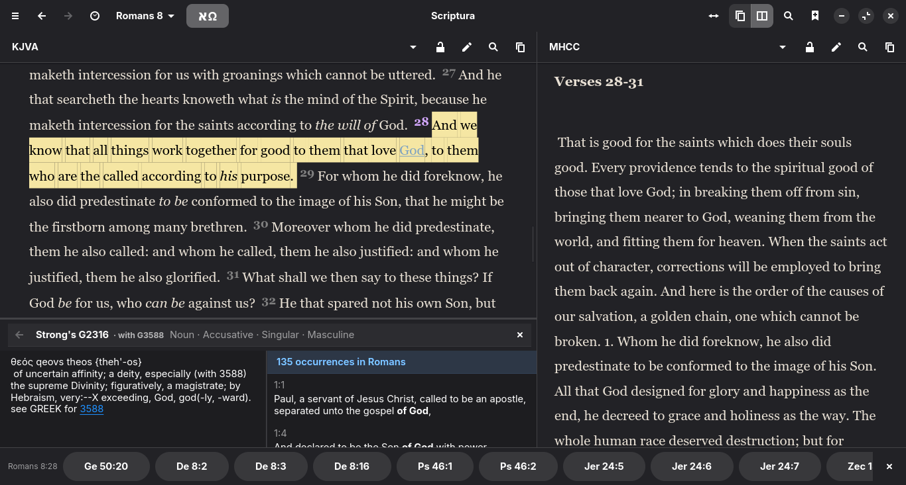
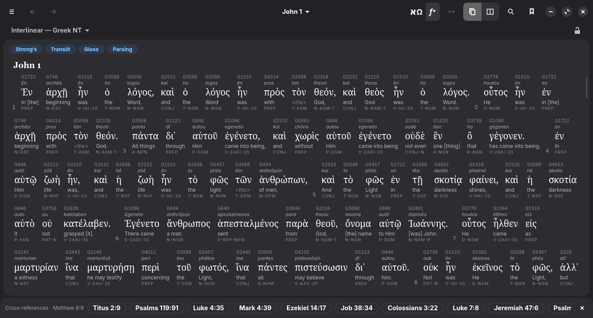
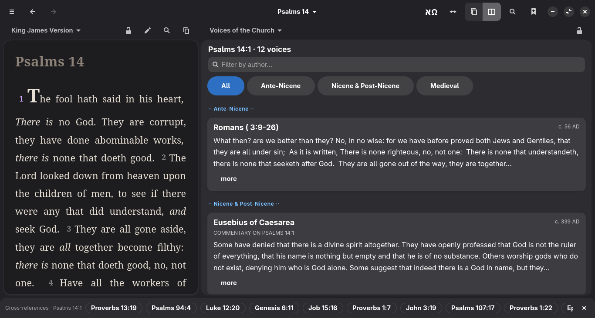
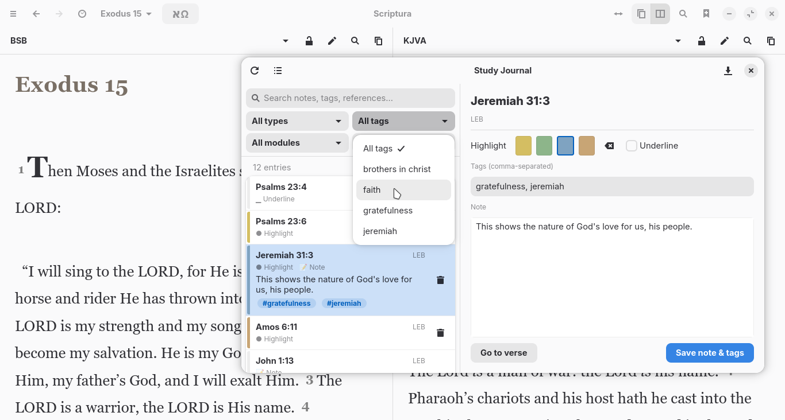
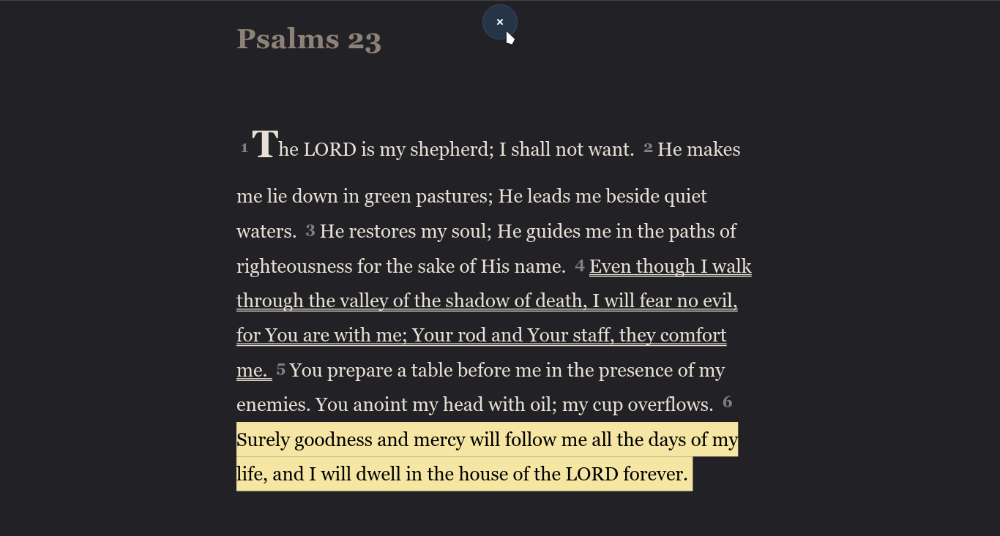

# Scriptura

A native Linux Bible study app for people who study and teach the
Word. Two-pane reading, SWORD modules, Greek and Hebrew interlinears,
Strong's lexicon, full-text search, per-verse notes: all on your own
machine, all in service of a quiet, focused hour with Scripture.

Built on GNOME with GTK4 + libadwaita, in Python, GPL-3.0.

> _"For the word of God is living and active, sharper than any
> two-edged sword..."_ — Hebrews 4:12



---

## What it does

- **Read two translations side by side.** Each pane has its own
  module picker; lock one in place while you navigate in the other.
- **Strong's lexicon at a click.** Click any tagged Hebrew or Greek
  word for the original lexeme, its morphology, and a word-study
  list of every verse in the current book that uses the same Strong's
  number.
- **Greek and Hebrew interlinears.** Choose an interlinear in either
  pane and read the Greek New Testament or the Hebrew Old Testament
  word by word: a context-sensitive English gloss and parsing under
  every word, transliteration and Strong's numbers a chip away, the
  full parse on hover, the lexicon a click away. Word data from
  Tyndale House, Cambridge (STEPBible).
- **A scholar's Greek lexicon.** An optional pack pairs Abbott-Smith's
  manual lexicon with the complete Liddell-Scott-Jones, one click
  apart. Scripture citations inside an entry are live: click one to
  peek the verse in place, or send it to the other pane.
- **Commentaries, devotionals, and confessions.** Matthew Henry,
  Calvin, Clarke, Spurgeon's Morning & Evening, the Westminster
  Confession, the Augsburg Confession, the Didache, the Apostolic
  Fathers, and anything else CrossWire packages in SWORD format.
- **Annotate your study.** Four highlight colors, underlines, notes
  with topical tags, chapter-level notes. Everything you mark lives
  in plain JSON in your XDG config directory, yours to back up,
  sync, or migrate.
- **The church through the centuries.** An optional Historical
  Commentaries pack shows how the church read each verse across time:
  the ante-Nicene fathers, the medieval doctors, and the Reformers,
  a chorus of voices synced to the verse you're studying, from
  Irenaeus to Calvin.
- **Scripture in Art.** An optional imagery pack matched to the
  passage you're reading: Schnorr von Carolsfeld and Doré engravings,
  Tissot watercolours, Old Master paintings, Byzantine icons, stained
  glass, and illuminated manuscripts, alongside journey maps whose
  passage chips drive the Bible pane to the verses they cover.
- **Scripture in Stone.** A bundled archaeology gallery: excavated
  artifacts that touch the biblical text, with photographs,
  provenance, and the passages they illuminate.
- **Cross-references.** OpenBible.info's 340,000-reference database
  is one click away (Module Manager → Study Tools). TSK is the
  fallback when you're offline.
- **Full-text search.** Fast per-module SQLite FTS5 index with phrase,
  AND/OR, exclude, and prefix queries; a distribution chart across the
  canon, case-sensitive option, and F3 step-through.
- **Study Journal.** Every annotation, across every module, in one
  filterable surface. Search free-text, filter by tag or module or
  book, click a row to jump back to the verse.
- **Reading plans.** Six built-in: Bible in a Year (straight or
  blended four-stream), the Old Testament in a year, the New
  Testament in 90 days, Psalms in 30 days, Proverbs in 31 days.
- **Modern translations.** LEB, BSB, ASV, and the rest of the
  eBible.org catalog: translations SWORD doesn't carry, fetched on
  demand into a local SQLite store.
- **Bring your own modules.** Already have a SWORD module on disk (a
  translation you bought, a draft a colleague shared, something
  CrossWire no longer hosts)? Drag the `.zip` onto the Module Manager
  (or use the import button) and it's installed. Locked commercial
  modules ask for their publisher's key.
- **F11 reading mode, F5 presentation mode.** F11 makes the chrome
  disappear for reading. F5 projects the current passage full screen
  for a projector or mirrored display, with paging across chapters, a
  verse-per-page toggle, live type-size control, and a side-by-side
  view of two translations.

Scriptura runs entirely on your computer. There is no telemetry,
no account, no background phone-home. The only time the app uses the
network is when you explicitly download a module, fetch a translation
from eBible.org, or install an open-data file. Your study is your
own.

| | |
|:---:|:---:|
|  |  |
| _Greek NT interlinear_ | _Historical Commentaries_ |
|  |  |
| _Study Journal_ | _Reading mode (dark)_ |

---

## Install

[](https://andresmessina-sdg.github.io/scriptura-flatpak/scriptura.flatpakref)
[](LICENSE)

The easiest way to run Scriptura (one click, automatic updates):

**[➜ Install Scriptura (Flatpak)](https://andresmessina-sdg.github.io/scriptura-flatpak/scriptura.flatpakref)**

Or from a terminal:

```bash
flatpak install https://andresmessina-sdg.github.io/scriptura-flatpak/scriptura.flatpakref
```

You'll need [Flatpak](https://flatpak.org/setup/) with the Flathub remote (for
the GNOME runtime). Updates arrive automatically with `flatpak update`. The
build is GPG-signed and served from this project's own repository.

Prefer to run from source? See **Installing dependencies** below.

---

## Installing dependencies

Use whichever section matches your distribution.

### Fedora

```sh
sudo dnf install python3-gobject gtk4 libadwaita \
                 sword python3-sword
```

### Ubuntu / Debian / Zorin OS / Pop!_OS / Mint

```sh
sudo apt install python3-gi python3-gi-cairo \
                 gir1.2-gtk-4.0 gir1.2-adw-1 \
                 python3-sword git
```

Full-text search uses SQLite FTS5, which ships with Python's standard
`sqlite3` module; there's no separate search package to install.

### Arch / Manjaro / EndeavourOS / CachyOS

```sh
sudo pacman -S --needed python-gobject gtk4 libadwaita \
                        sword git
```

Arch ships both `libsword` and the Python bindings in the same
`sword` package. You can launch the app with `python main.py`;
the `python3` alias works too.

---

## Running

The app is plain Python, with no build step:

```sh
git clone https://github.com/andresmessina-SDG/scriptura.git
cd scriptura
python3 main.py
```

On first launch the welcome screen offers three curated starting
points, framed by what you get rather than by module names: *Just
reading* (one Bible, quick download), *Reading + study* (recommended:
a few translations, historical commentary, and original-language
study tools), and *Full library* (the complete set). Pick one and
start reading; everything can be added or removed later from the
Module Manager.

---

## A few quiet design choices

- **No web view.** The Bible text renders in a native `GtkTextView`
  with Pango markup: it starts faster, scrolls smoother, and inherits
  your system fonts and theme without us hardcoding anything.
- **Annotations apply in place.** Highlighting a verse doesn't reload
  the chapter or jump your scroll position. The mark just appears
  where the verse is.
- **Soft palette.** Highlight colors render as muted pastels at view
  time even though stored as their familiar yellow / green / blue /
  orange; easier on the eyes for long sessions.
- **The reading column has a cap.** On wide monitors the verse text
  stays at a comfortable reading width; the scrollbar lives at the
  pane edge, not inside the column. Adjustable via the Width slider
  in the menu panel.
- **F11 hides everything.** Chrome, toolbars, panels: just the
  Word.

---

## Tiling compositors (Hyprland, sway, river)

Mutter (GNOME) floats child windows above their parent automatically.
Tiling compositors need a hint. For Hyprland:

```hyprlang
windowrulev2 = float, title:^(Module Manager|Study Journal|Tag Manager|Keyboard Shortcuts)$
windowrulev2 = float, title:^(Save .*|Export .*|Rename .*|Remove .*)$
windowrulev2 = float, title:^(Scriptura)$, floating:1
```

`xdg-desktop-portal-gtk` (or `-hyprland`) needs to be installed
for the Export Study Journal file picker to work:

```sh
# Fedora
sudo dnf install xdg-desktop-portal-gtk
# Debian / Ubuntu / Zorin
sudo apt install xdg-desktop-portal-gtk
# Arch
sudo pacman -S xdg-desktop-portal-gtk
```

---

## Running the tests (for contributors)

The pytest suite covers the pure-Python layers (`sword_bridge`,
`open_data`, `annotations`, `reading_plans`, `paths`, `bookmarks`,
`settings`, `ebible_bridge`, etc.) and a growing GTK layer (panes,
the lexicon panel, interlinear and presentation paging): 509 tests,
around fifteen seconds.

```sh
# Fedora
sudo dnf install python3-pytest
# Debian / Ubuntu / Zorin
sudo apt install python3-pytest
# Arch
sudo pacman -S python-pytest
# Or any distribution:
pip install -r requirements-dev.txt

python3 -m pytest
```

Beyond the suite, a scroll-stability harness
(`tools/verify-scroll-stability.py`) drives the real app headless to
guard the reading view's scroll anchoring, and Woodpecker CI runs the
tests and mypy on every push. See
[`ARCHITECTURE.md`](ARCHITECTURE.md) for the internal map: file
layout, render pipeline, known SWORD and GTK4 quirks worth knowing
before touching the rendering code.

---

## What goes where

Your data lives in standard XDG directories so it survives across
installs and is easy to back up:

- `~/.config/bible-reader/`: preferences, bookmarks, reading-plan
  progress, per-module reading positions.
- `~/.local/share/bible-reader/`: annotations, eBible database,
  downloaded reference files.
- `~/.cache/bible-reader/`: search history, regenerable indexes.
- `~/.sword/`: SWORD's own module library (CrossWire convention,
  shared with any other SWORD-compatible tool you use).

Wipe any of these to reset the corresponding part of the app to
factory defaults.

---

## Reporting bugs

If something misbehaves, especially anything SWORD-related (a module
fails to load, a chapter is blank, search returns nothing), re-run
with verbose logging and include the output in the report:

```sh
SCRIPTURA_LOG_LEVEL=DEBUG python3 main.py
```

Logs go to stderr, prefixed with the component (`scriptura.sword`,
`scriptura.search`, `scriptura.ebible`, …) and include full
tracebacks for any caught exception. The default level is `WARNING`
so normal runs stay quiet.

---

## Credits

This app stands on the work of others:

- **The SWORD Project**: CrossWire Bible Society, who have spent
  decades building the cross-platform Bible-software library this
  app is built on, and have curated more than two hundred text
  modules in over fifty languages.
- **STEPBible / Tyndale House, Cambridge**: the amalgamated Greek
  New Testament and Hebrew Old Testament word data behind the
  interlinears (TAGNT, TAHOT), and the Abbott-Smith and
  Liddell-Scott-Jones data behind the scholar's Greek lexicon (TBESG,
  TFLSJ). All CC BY 4.0, fetched from their repository at install
  time.
- **OpenBible.info**: cross-references and topical tags, released
  under CC-BY. The reason a click on a verse can show you everywhere
  else Scripture has interpreted Scripture.
- **Dodson Greek Lexicon**: public-domain NT Greek definitions.
- **eBible.org**: the modern licensed translations (LEB, BSB, ASV,
  and many more) that complete the picture.
- **HistoricalChristianFaith Commentaries Database**: the
  public-domain patristic, medieval, and Reformation commentary that
  powers the Historical Commentaries pack.
- **Wikimedia Commons & Project Gutenberg**: the public-domain and
  openly-licensed scans behind the Scripture in Art pack: Schnorr von
  Carolsfeld and Doré engravings, Tissot watercolours, Old Master
  paintings, Byzantine icons, stained glass, illuminated manuscripts,
  Hurlbut's *Bible Atlas* (1882), modern public-domain journey maps,
  and the place photographs (per-item credits shown in the app).
- **GNOME**: the platform that makes a clean reading experience
  possible on Linux: GTK4, libadwaita, PyGObject.
- **SQLite FTS5**: the full-text search engine, built into Python's
  standard library, that indexes every Bible the moment you ask.

---

## License

GPL-3.0-or-later. See [`LICENSE`](LICENSE) for the canonical text.
The SWORD library this app links against is also GPL-licensed.

---

## A note on how this app was built

Scriptura is one person's project, built with the help of an AI
assistant. Every feature, every design decision, every bug report
came from sitting with Scripture and thinking about what the tool
should do; the assistant made the implementation faster. The vision,
the choices, and the testing were mine. I wanted a Bible-study app
that fit how I read.

The source is open and the architecture is documented. Pull requests,
bug reports, and translation contributions are all welcome.

---

## Repository

[github.com/andresmessina-SDG/scriptura](https://github.com/andresmessina-SDG/scriptura)
